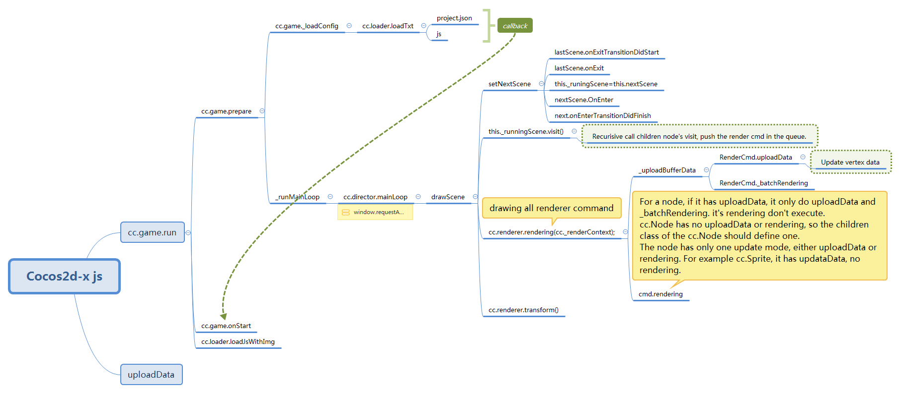

# Game Develop

## cocos-develop

cocos 基本概念
https://docs.cocos.com/cocos2d-x/manual/zh/basic_concepts/

cocos基础入门
https://www.codercto.com/a/5519.html

包含样例工程的代码
https://github.com/cocos2d/cocos2d-js

js api接口
https://docs.cocos2d-x.org/api-ref/js/v3x/

cocos2d-js 入门 （主要是HTML5）
https://cloud.tencent.com/developer/article/1155588

cocos2d中对于图片动画加载缓存的使用
https://www.jianshu.com/p/d3204315b1f6

cocos-lua 贝塞尔曲线 抛物线
https://www.jianshu.com/p/9610a857e89e

坐标计算
https://wenku.baidu.com/view/8758197b7fd5360cbb1adb01.html?fr=search-3-wk_sea

## 其他

nwjs帮助文档
https://nwjs-cn.readthedocs.io/zh_CN/latest/References/Command%20Line%20Options/index.html

Cocos2d-x3.2与OpenGL渲染总结(一)Cocos2d-x3.2的渲染流程
https://blog.csdn.net/cbbbc/article/details/39449945

WebGL
https://www.jianshu.com/p/75b1b4b701f7
https://developer.mozilla.org/zh-CN/docs/Web/API/WebGL_API

1.4	可以解包的资源
https://ftp-apk.pconline.com.cn/pub/download/201010/hdqb_v25.176.apk?md5=Z3yw7D6cs70vrs6hZVtSiQ&expires=1597309622

## shader

GLSL/openGL 入门
https://github.com/wshxbqq/GLSL-Card

openGL教程
https://learnopengl-cn.github.io/

1.5	Cocos2dx-js3.15 shader简单分享
https://www.jianshu.com/p/0b28707acef5

shader介绍
https://thebookofshaders.com/01/?lan=ch

SDF 计算点是否在物体内部。
https://www.iquilezles.org/www/articles/distfunctions/distfunctions.htm

一文讲透2d符号距离函数
https://vjmap.com/index.php/2021/02/26/%E4%B8%80%E6%96%87%E8%AE%B2%E9%80%8F2d%E7%AC%A6%E5%8F%B7%E8%B7%9D%E7%A6%BB%E5%87%BD%E6%95%B0sign-distance-function-sdf/

渲染基础-渲染管线（Render-pipeline）
https://blog.csdn.net/AvatarForTest/article/details/80438344

渲染管线入门
https://blog.csdn.net/nikoong/article/details/79776873

如何理解 OpenGL 中着色器、渲染管线、光栅化等概念？
https://www.zhihu.com/question/29163054

Cocos2d-js中使用Shader方法 
--直接嵌入shader脚本 可以用
https://www.cnblogs.com/fingerblog/p/5179853.html

cocos2dx-js Shader的使用(高斯模糊)
--不能用，使用内嵌shader脚本也不行
https://blog.csdn.net/afei198409/article/details/77839330

水波纹效果
http://www.cocoachina.com/bbs/read.php?tid-1693873-page-1.html

https://forum.cocos.org/t/shader-creator-cocos2dx/49505/6

随便聊聊水面效果的2D实现（一）
https://blog.csdn.net/tkokof1/article/details/40819225
https://cloud.tencent.com/developer/article/1175629

随便聊聊水面效果的2D实现（二）
https://cloud.tencent.com/developer/article/1175633

真实感水体渲染技术总结
https://zhuanlan.zhihu.com/p/95917609

使用Intel GPA在PC上分析Android游戏的渲染流程
https://zhuanlan.zhihu.com/p/68741433

## 工具：
图形编译：GIMP （PS替代） Hornil StylePix（简单图像编辑，容易死）

音乐编辑：Audacity

Unity游戏资源逆向工具
https://www.cnblogs.com/kekec/p/12175547.html

[unity 2020.3.17](https://download.unity3d.com/download_unity/a4537701e4ab/Windows64EditorInstaller/UnitySetup64-2020.3.17f1.exe?_ga=2.73825045.605454077.1630477879-786101800.1630477879)

TexturePacker
plist生成

DragonBones Pro
骨骼动画生成
